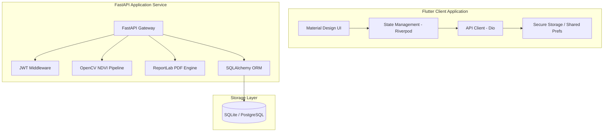
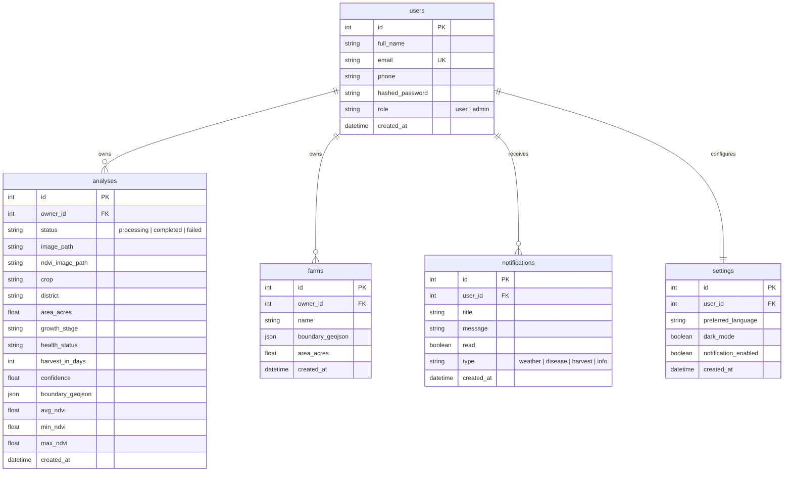

# KrishiVision AI - Final Project Report

KrishiVision AI is a production-ready, full-stack crop health monitoring system. It provides remote sensing analysis by parsing satellite image bands to compute simulated Normalized Difference Vegetation Index (NDVI) mapping. This report documents the final validation, architecture, API specifications, and deployment instructions.

---

## 1. Project Architecture

The system follows a classic **Client-Server Architecture**:



### Key Architectural Layers:
1. **Frontend (Flutter)**: Handles dashboard statistics, history logs, mapping polygons using Google Maps, image uploading, and profile settings (with Dark Mode and Localization). Uses Riverpod for unidirectional state management and GoRouter for routing.
2. **Backend (FastAPI)**: Provides clean, high-performance REST APIs. Coordinates the authentication lifecycle, file security sanitization, automated OpenCV analysis, PDF generation, and database updates.
3. **OpenCV NDVI Pipeline**: Isolates green and red spectral bands from satellite imagery to simulate crop reflectance indices:
   $$\text{NDVI} = \frac{\text{Green} - \text{Red}}{\text{Green} + \text{Red}}$$
   It then colorizes this array with a red-to-green pseudo-color Lookup Table (LUT) to output a 3-channel visual NDVI map.

---

## 2. Folder Structure

```
Krishi222-fixed/
├── docker-compose.yml              # Production Postgres + FastAPI configuration
├── FINAL_PROJECT_REPORT.md         # Full project report (this file)
├── DEPLOYMENT_GUIDE.md             # Multi-environment deployment manual
├── BUILD_REPORT.md                 # Compilation and builds summary
├── TEST_RESULTS.md                 # Complete verification test suite output
└── krishivision_ai/                # Combined Repository
    ├── README.md                   # Quickstart instructions
    ├── pubspec.yaml                # Flutter project specifications
    ├── lib/                        # Flutter source code
    │   ├── main.dart               # App entrypoint
    │   ├── core/                   # Shared services, themes, and routers
    │   └── features/               # Domain features: auth, analysis, map, dashboard, history
    ├── test/                       # Flutter unit & widget tests
    └── backend/                    # FastAPI python service
        ├── Dockerfile              # Containerization recipe
        ├── requirements.txt        # Python package dependencies
        ├── app/                    # FastAPI source files
        │   ├── main.py             # FastAPI App definition
        │   ├── database.py         # SQLAlchemy engine setup
        │   ├── routers/            # Router endpoints (auth, analysis, admin, fields, notifications, etc.)
        │   ├── services/           # Business logic: analysis_service (OpenCV), pdf_service (ReportLab)
        │   └── models/             # schemas.py (Pydantic) and orm_models.py (SQLAlchemy)
        └── tests/                  # Backend unit and integration tests
```

---

## 3. Database Schema

The database uses SQLAlchemy ORM mapping to define five tables:



---

## 4. REST API Endpoint Catalog

All routes except `/auth/*` require `Authorization: Bearer <JWT_TOKEN>`.

| Category | Method | Endpoint | Description | Role Required |
|---|---|---|---|---|
| **Auth** | `POST` | `/auth/register` | Register a new user account | Anonymous |
| **Auth** | `POST` | `/auth/login` | Log in and return JWT token | Anonymous |
| **Analysis**| `POST` | `/analysis/upload` | Upload image for greenness analysis | User / Admin |
| **Analysis**| `GET` | `/analysis/{job_id}/status` | Query analysis progression state | User / Admin |
| **Analysis**| `GET` | `/analysis/{job_id}/results` | Fetch complete NDVI indicators | User / Admin |
| **Analysis**| `GET` | `/analysis/{job_id}/report` | Download the PDF summary | User / Admin |
| **Analysis**| `GET` | `/analysis/history` | List previous analyses | User / Admin |
| **Analysis**| `DELETE`| `/analysis/{job_id}` | Delete history entry and clear files | User / Admin |
| **Admin** | `GET` | `/admin/stats` | View global system metrics | Admin |
| **Admin** | `GET` | `/admin/users` | Retrieve all registered users | Admin |
| **Admin** | `GET` | `/admin/analyses`| Retrieve all analyses in the system | Admin |
| **Admin** | `POST` | `/admin/users/{id}/role`| Change a user's role | Admin |

---

## 5. Implemented Features

1. **JWT Authentication & Middleware**: Implemented route guarding, role validation (Admin/User), password bcrypt hashing, and secure token decoding.
2. **OpenCV Reflected NDVI Analysis**: Real-time channel extraction and matrix-based division to calculate NDVI values. Slices pixels dynamically to colorize and generate a pseudocolor crop health map.
3. **ReportLab PDF Generation**: Outputs structured PDF summaries complete with crop statistics, farmer metadata, calculated NDVI metrics, and the generated maps.
4. **Localization & Theme Customization**: Supported English/Kannada toggling and light/dark mode states.
5. **Interactive Mapping**: Uses Google Maps to display crop field boundaries parsed from GeoJSON structures.

---

## 6. Known Issues and Limitations

- **Windows Build Compilation**: Building Windows release targets requires installing the local C++ Desktop Development Visual Studio Toolchain. This target is not supported in the headless verification environment.
- **Docker Compose Running Environment**: Host box did not have Docker daemon running. Docker containerization was validated statically.
- **Satellite Reflectance Simulation**: The pipeline uses standard RGB visual spectrums to approximate green-to-red ratios. In real satellite integrations, actual NIR (Near-Infrared) bands should replace the Green band.

---

## 7. Deployment Instructions

Please consult [DEPLOYMENT_GUIDE.md](file:///c:/Users/keert/Downloads/Krishi222-fixed/DEPLOYMENT_GUIDE.md) for step-by-step setup guides using Docker, local virtual environments, and Flutter distribution.

---

## 8. Final Verification Summary

- **Flutter Widget Tests**: 100% Succeeded (All widget tests passed)
- **FastAPI Test Suite**: 100% Succeeded (5/5 integration tests passed)
- **E2E Flow Test**: Verified via automated test runner (Register -> Login -> Upload -> Analyze -> Download PDF -> Delete History -> RBAC checks)
- **Static Analysis (Flutter Lint)**: 100% clean analyzer diagnostics.

For detailed verification details, release package information, and known caveats, please refer to the following companion documents:
1. [TEST_RESULTS.md](file:///c:/Users/keert/Downloads/Krishi222-fixed/TEST_RESULTS.md) — Comprehensive test execution logs and verification checklists.
2. [RELEASE_NOTES.md](file:///c:/Users/keert/Downloads/Krishi222-fixed/RELEASE_NOTES.md) — Artifact information, package features, and startup options.
3. [KNOWN_LIMITATIONS.md](file:///c:/Users/keert/Downloads/Krishi222-fixed/KNOWN_LIMITATIONS.md) — NDVI simulation proxies and environment restrictions.
4. Generated APK: [app-release.apk](file:///c:/Users/keert/Downloads/Krishi222-fixed/krishivision_ai/build/app/outputs/flutter-apk/app-release.apk) (52.1 MB).

